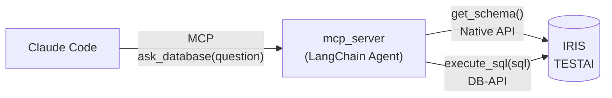

# text2sql — IRIS で Text to SQL

日本語で質問すると、LLM（OpenAI `o4-mini`）が SQL を組み立てて InterSystems IRIS 上で実行し、結果を返してくれるサンプルです。
Claude Code から MCP ツール `ask_database` として呼び出せます。

> 「山田太郎さんの処方履歴を教えて」→ テーブル定義を取得 → SELECT 文を生成 → IRIS で実行 → 結果を回答

## 仕組み



1. `get_schema()` で `^Test.SQLText(クラス名)` グローバルからテーブル定義テキストを取得（対象は `config/tables.json` の全クラス）
2. `o4-mini` が定義をもとに SELECT 文を作成
3. `execute_sql(sql)` で実行（SELECT 以外は拒否、結果は `MAX_RESULT_ROWS` 行まで）
4. 自然文の回答に加えて、実行された SQL と生の結果データを返す

`^Test.SQLText` は、`Test.SQLText` を継承したデータクラスをコンパイルしたときに自動生成される
`CREATE TABLE` 形式のテキストです（CAPTION や `DISPLAYLIST` / `VALUELIST` も含まれます）。

## ディレクトリ構成

```
├── mcp_server/    # MCP サーバー本体（server / agent / tools / iris_client / settings）
├── scripts/       # check_connection.py（疎通確認）, seed_sample_data.py（サンプルデータ投入）,
│                  # export_iris_classes.py（IRIS のクラスを src/cls に書き出し）
├── src/cls/Test/  # IRIS 側ソース（SQLText / Patient / Order20 ほか）
├── config/tables.json   # 対象クラス名の一覧
├── data/sample_data.gof # サンプルデータ（グローバルエクスポート）
├── .mcp.json      # Claude Code 用 MCP サーバー登録
└── .env.example   # 環境変数の雛形
```

## セットアップ

必要なもの: Python 3.12、IRIS（ネームスペース `TESTAI`）、OpenAI の API キー、Claude Code

**1. Python 環境**

```powershell
git clone https://github.com/dc-ikeda/test-to-sql.git
cd test-to-sql
python -m venv .venv
.venv\Scripts\Activate.ps1
pip install -r requirements.txt
```

**2. `.env` を作る**

`.env.example` をコピーして、`IRIS_USERNAME` / `IRIS_PASSWORD` / `OPENAI_API_KEY` などを設定します（`.env` はコミットしないでください）。

**3. IRIS にクラスを取り込む**

`TESTAI` ネームスペースで、`src/cls/Test/` の `SQLText.cls` → `Patient.cls` → `Order20.cls` を取り込んでコンパイルします。

```objectscript
Do $SYSTEM.OBJ.Load("C:\path\to\src\cls\Test\SQLText.cls", "ck")
```

コンパイル時に `^Test.SQLText` が生成されます。

**4. サンプルデータを入れる**

```powershell
python scripts/seed_sample_data.py   # 患者10件・処方13件。何度実行しても安全
```

**5. 接続確認**

```powershell
python scripts/check_connection.py
```

## Claude Code から使う

リポジトリのルートで Claude Code を起動すると、`.mcp.json` の MCP サーバー `text2sql` が使えます
（初回は承認が必要。`/mcp` で接続状態を確認できます）。あとは日本語で聞くだけです。

- 男性の患者情報を教えて
- 山田太郎さんの処方履歴を教えて
- 診療科ごとの処方件数を教えて

※ `.mcp.json` の `command` は Windows 用（`.venv/Scripts/python.exe`）です。macOS / Linux は `.venv/bin/python` に変えてください。

## テーブルを増やす

データクラスを `Extends (%Persistent, Test.SQLText)` で作り、`Projection CreateProjection As Test.SQLText;` を付けてコンパイルし
（`Test.Patient` を参考に）、`config/tables.json` にクラス名を追記します。IRIS 側を自動で走査はしません。

## 補足: IRIS 側だけで動かす実装

`src/cls/Test/` には、Python を使わない実装も入っています。

- `Test.OpenAIClient` — ObjectScript + Embedded Python で OpenAI を直接呼ぶ。`Do ##class(Test.OpenAIClient).TestSQL("男性の患者情報を教えて")`
  （`.env` のパスがクラスパラメータ `ENVFILE` に固定なので、自分の環境に合わせて変更）
- `Test.Agent` / `Test.Tools` / `Test.AgentTool` / `Test.Service` — IRIS の `%AI` パッケージで作った Agent と MCP サービス。
  モデルは `Test.Agent` の `MODEL`（`gpt-4.1-mini`）で、Python 版の `OPENAI_MODEL` とは別です

## 注意事項

- 質問文・テーブル定義・SQL の実行結果は OpenAI の API に送信されます。サンプルは架空データですが、実データで使う場合はご注意ください
- SELECT の検証は簡易的なものです。接続する IRIS ユーザーは参照権限のみにすることをおすすめします

## ライセンス

MIT License（[LICENSE](LICENSE)）
